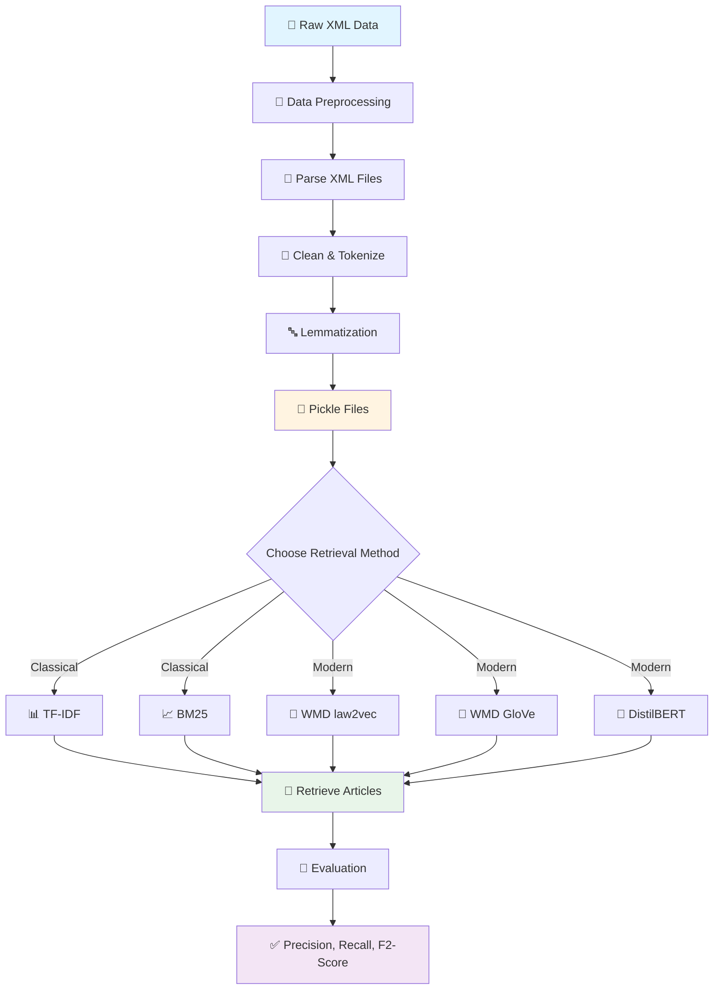
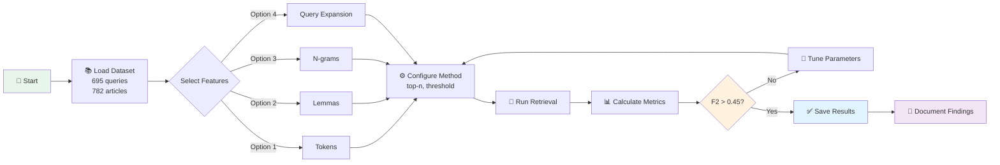
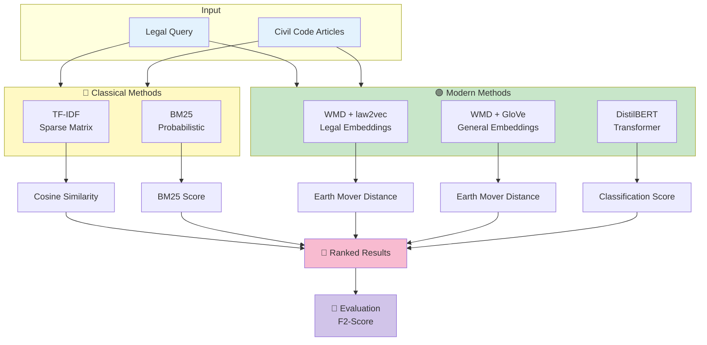
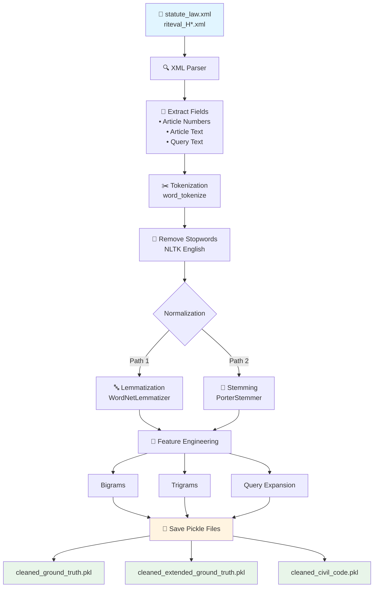
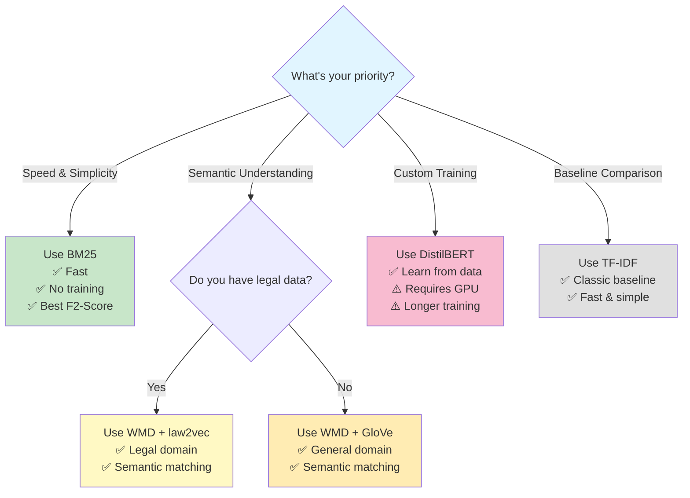

# Legal Information Retrieval System for COLIEE

> An intelligent legal document retrieval system using both classical and modern machine learning approaches to find relevant Japanese Civil Code articles for legal queries.

[](https://www.python.org/downloads/)
[](https://opensource.org/licenses/MIT)
[](https://jupyter.org/)

## 📋 Table of Contents

- [Overview](#overview)
- [The Problem](#the-problem)
- [Our Solution](#our-solution)
- [System Architecture & Workflow](#system-architecture--workflow)
- [Project Structure](#project-structure)
- [Installation](#installation)
- [Usage](#usage)
- [Retrieval Methods](#retrieval-methods)
- [Results](#results)
- [Dataset](#dataset)
- [Contributing](#contributing)
- [License](#license)
- [Contact](#contact)

## 🔍 Overview

This project tackles **COLIEE Task 3** (Competition on Legal Information Extraction/Entailment) - a challenging legal information retrieval task. Given a legal query in English, the system retrieves the most relevant articles from the Japanese Civil Code (translated to English).

**Key Highlights:**
- 🎯 Multi-document retrieval (1-6 relevant articles per query)
- 📊 Compares 5 different retrieval approaches
- 🏆 Achieves F2-score of 0.459 with BM25
- 📚 Built on COLIEE 2020 dataset (700 queries, 782 articles)

## 🎯 The Problem

Legal professionals often need to find relevant statute laws for specific legal cases. This is challenging because:

- Legal texts use specialized terminology and complex language structure
- Queries may not use the same words as relevant articles (semantic gap)
- Multiple articles may be relevant to a single query
- Missing relevant articles can have serious legal consequences

**Example Query:**
> "A person who has begun the prescription period in bad faith or has acquired the subject matter by a tortious act is not entitled to establishment of prescription if five years do not pass from the time when it became available to be known by the person who benefited from the completion of prescription."

**Relevant Article:** Article 162-2 of the Japanese Civil Code

## 💡 Our Solution

We implement and compare **5 different retrieval approaches**:

### Classical Methods (Baseline)
1. **TF-IDF** - Term frequency-inverse document frequency with cosine similarity
2. **BM25** - Probabilistic ranking function (best classical performer)

### Modern Methods (Neural)
3. **Word Mover's Distance (law2vec)** - Using legal domain-specific embeddings
4. **Word Mover's Distance (GloVe)** - Using general-purpose embeddings
5. **DistilBERT** - Transformer-based binary relevance classification

Each method is tuned with various preprocessing techniques including query expansion, lemmatization, and n-gram features.

## 🎨 System Architecture & Workflow

### Overall System Pipeline

This diagram shows the complete flow from raw data to final evaluation:



### Experimental Workflow

This shows how we conduct and compare experiments:



### Method Comparison Architecture

Here's how different retrieval methods work:



### Data Preprocessing Pipeline

Detailed view of how we prepare the data:



### Quick Decision Guide

Use this to choose the right method for your needs:



## 📁 Project Structure

```
legal_text_retrieval_coliee/
│
├── 📄 README.md                          # You are here!
├── 📄 CLAUDE.md                          # AI assistant documentation
├── 📄 Information_Retrieval_Project.pdf  # Detailed research report
│
├── 📂 data/                              # Dataset storage
│   ├── statute_law.xml                   # Japanese Civil Code (782 articles)
│   ├── riteval_H*.xml                    # Query-article pairs (2006-2017)
│   └── cleaned_*.pkl                     # Preprocessed data files
│
├── 📂 embeddings/                        # Word embeddings
│   ├── Law2Vec.200d.txt                  # Legal domain embeddings
│   └── GoogleNews-vectors-300d.bin.gz    # General embeddings
│
└── 📂 src/                               # Source code
    │
    ├── 📂 data_analaysis/
    │   ├── parse_statute_law.ipynb       # XML → DataFrame conversion
    │   └── data_analysis.ipynb           # EDA and preprocessing
    │
    ├── 📂 classical_approach/
    │   └── classical_approach.ipynb      # TF-IDF & BM25 implementations
    │
    └── 📂 modern_approach/
        ├── 📂 DistilBERT/
        │   ├── COLIEE_transformer.ipynb
        │   ├── create_classification_Dataset.ipynb
        │   └── create_downsample_classification.ipynb
        │
        └── 📂 WMD/
            └── wmd.py                     # Word Mover's Distance script
```

## 🚀 Installation

### Prerequisites

- Python 3.7 or higher
- Jupyter Notebook or Google Colab
- At least 4GB RAM (8GB recommended for transformer models)

### Step 1: Clone the Repository

```bash
git clone https://github.com/VenkateshDas/legal_text_retrieval_coliee.git
cd legal_text_retrieval_coliee
```

### Step 2: Install Dependencies

```bash
pip install pandas numpy nltk gensim transformers rank-bm25 word_mover_distance scikit-learn matplotlib
```

### Step 3: Download NLTK Data

```python
import nltk
nltk.download('punkt')
nltk.download('stopwords')
nltk.download('wordnet')
```

### Step 4: Download Embeddings

- **Law2Vec**: Place `Law2Vec.200d.txt` in the `embeddings/` folder
- **GloVe**: Download [GoogleNews-vectors-negative300](https://drive.google.com/file/d/0B7XkCwpI5KDYNlNUTTlSS21pQmM/edit) and place in `embeddings/`

### Step 5: Prepare Data

Download the COLIEE 2020 dataset and place XML files in the `data/` folder, then run:

```bash
# In Jupyter: Run notebooks in order
1. src/data_analaysis/parse_statute_law.ipynb
2. src/data_analaysis/data_analysis.ipynb
```

## 📖 Usage

### Quick Start - Classical Approaches

```python
# Open the classical approach notebook
jupyter notebook src/classical_approach/classical_approach.ipynb

# The notebook includes:
# - TF-IDF retrieval with tunable parameters
# - BM25 retrieval with threshold optimization
# - Automatic evaluation with Precision, Recall, F2-score
```

### Quick Start - Word Mover's Distance

```bash
cd src/modern_approach/WMD/
python wmd.py
```

**Interactive prompts:**
```
Enter the name of the Embedding --> 'law2vec' or 'glove': law2vec
Enter the number of articles to be retrieved: 3
Enter the threshold for the similarity score: 0.6
Enter 1 for query lemmas or 2 for query expansion: 2
```

### Quick Start - DistilBERT

```python
# Open the transformer notebook
jupyter notebook src/modern_approach/DistilBERT/COLIEE_transformer.ipynb

# The notebook handles:
# - Dataset loading and preprocessing
# - Model fine-tuning on legal query-article pairs
# - Evaluation on test set
```

### Example Output (TREC Format)

```
R001 Q0 Article_162-2 1 0.875 OVGU
R001 Q0 Article_145 2 0.743 OVGU
R002 Q0 Article_398 1 0.821 OVGU
...
```

## 🔬 Retrieval Methods

### 1. TF-IDF (Term Frequency-Inverse Document Frequency)

**How it works:**
- Computes importance of words based on frequency in document vs. corpus
- Uses sparse matrix similarity for fast retrieval
- Good for keyword matching

**Best Configuration:**
- Feature: Lemmas
- Top-N: 2
- Threshold: 0.33

### 2. BM25 (Best Match 25)

**How it works:**
- Probabilistic ranking function
- Considers document length normalization
- State-of-the-art classical IR method

**Best Configuration:**
- Feature: Lemmas
- Rank: 3
- Threshold: 7

### 3. Word Mover's Distance (WMD)

**How it works:**
- Computes semantic distance using word embeddings
- Finds optimal alignment between query and article words
- Captures semantic similarity beyond keyword matching

**Variants:**
- **law2vec**: Legal domain-specific embeddings (200d)
- **GloVe**: General-purpose embeddings (300d)

### 4. DistilBERT (Transformer-based)

**How it works:**
- Fine-tuned DistilBERT model for binary classification
- Predicts if query-article pair is relevant
- Captures deep semantic relationships

**Advantages:**
- Learns from training data
- Handles long-range dependencies
- State-of-the-art NLP architecture

## 📊 Results

### Performance Comparison

| Method | Precision | Recall | **F2-Score** | Notes |
|--------|-----------|--------|--------------|-------|
| **BM25** (best) | 0.335 | **0.506** | **0.459** | ✅ Best overall performance |
| TF-IDF | 0.349 | 0.446 | 0.423 | Good baseline |
| WMD (law2vec) | ~0.35 | ~0.45 | ~0.42 | Domain-specific embeddings |
| WMD (GloVe) | ~0.34 | ~0.44 | ~0.41 | General embeddings |
| DistilBERT | Variable | Variable | Variable | Requires extensive training |

> **Note:** F2-score emphasizes recall over precision, which is appropriate for legal retrieval where missing relevant articles is more costly than retrieving some irrelevant ones.

### Key Insights

✅ **Classical methods are competitive** - BM25 outperforms neural methods with proper tuning
✅ **Query expansion helps** - Adding synonyms improves recall by ~5-10%
✅ **Lemmatization matters** - Better than raw tokens for legal text
✅ **Domain embeddings help** - law2vec slightly outperforms general GloVe
✅ **Threshold tuning is critical** - Can improve F2-score by 10-15%

## 📚 Dataset

### COLIEE 2020 Dataset Statistics

| Metric | Value |
|--------|-------|
| **Total Queries** | 695 |
| **Civil Code Articles** | 782 |
| **Relevant Pairs** | 901 |
| **Avg. Relevant Articles/Query** | 1.3 |
| **Max Relevant Articles/Query** | 6 |
| **Language** | English (translated from Japanese) |

### Data Distribution

- **538 queries** have exactly 1 relevant article (77%)
- **157 queries** have 2-6 relevant articles (23%)
- **Class imbalance** is a key challenge for classification approaches

### Data Files

After preprocessing, the following pickle files are generated:

- `cleaned_ground_truth.pkl` - Query texts with ground truth labels
- `cleaned_extended_ground_truth.pkl` - Queries with synonym expansion
- `cleaned_civil_code.pkl` - Civil Code articles with preprocessing

## 🛠️ Advanced Usage

### Custom Retrieval Pipeline

```python
import pandas as pd
from rank_bm25 import BM25Okapi

# Load preprocessed data
df_queries = pd.read_pickle("data/cleaned_ground_truth.pkl")
df_articles = pd.read_pickle("data/cleaned_civil_code.pkl")

# Extract lemmatized features
query_lemmas = df_queries["Query_lemma"].tolist()
article_lemmas = df_articles["Article_description_lemmas"].tolist()

# Initialize BM25
bm25 = BM25Okapi(article_lemmas)

# Retrieve for a query
scores = bm25.get_scores(query_lemmas[0])
top_n = scores.argsort()[-3:][::-1]  # Top 3 articles

print(f"Top 3 articles: {df_articles.iloc[top_n]['Article_number'].tolist()}")
```

### Hyperparameter Tuning

```python
# Grid search over parameters
for top_n in [2, 3, 4, 5]:
    for threshold in [5, 6, 7, 8]:
        # Run retrieval
        results = run_bm25_retrieval(top_n=top_n, threshold=threshold)
        # Evaluate
        f2_score = calculate_f2(results)
        print(f"top_n={top_n}, threshold={threshold}, F2={f2_score}")
```

## 🤝 Contributing

We welcome contributions! Here's how you can help:

### Ways to Contribute

- 🐛 **Report bugs** - Open an issue with reproduction steps
- 💡 **Suggest features** - Propose new retrieval methods or improvements
- 📝 **Improve documentation** - Fix typos, add examples, clarify explanations
- 🔬 **Add experiments** - Try new preprocessing techniques or models
- 📊 **Benchmark results** - Compare with other COLIEE systems

### Development Workflow

1. Fork the repository
2. Create a feature branch (`git checkout -b feature/amazing-feature`)
3. Make your changes
4. Run experiments and document results
5. Commit your changes (`git commit -m 'Add amazing feature'`)
6. Push to the branch (`git push origin feature/amazing-feature`)
7. Open a Pull Request

### Code Guidelines

- Follow existing code style (PEP 8 for Python)
- Document your retrieval methods in notebooks
- Include evaluation metrics (Precision, Recall, F2-score)
- Update README if adding new features

## 📄 License

This project is licensed under the MIT License - see the [LICENSE](LICENSE) file for details.

## 📖 Citation

If you use this code in your research, please cite:

```bibtex
@misc{legal_ir_coliee2020,
  title={Legal Information Retrieval Using Traditional Approaches and Binary Relevance Classification},
  author={Your Name},
  year={2020},
  publisher={GitHub},
  url={https://github.com/VenkateshDas/legal_text_retrieval_coliee}
}
```

## 🔗 Related Resources

- [COLIEE Competition Official Website](http://www.coliee.org/)
- [COLIEE 2020 Task Description](http://www.coliee.org/2020.html)
- [Japanese Civil Code (English Translation)](http://www.japaneselawtranslation.go.jp/)
- [Law2Vec Paper](https://arxiv.org/abs/1805.11672) - Legal domain word embeddings

## 📞 Contact

**Project Maintainer:** Venkatesh Das

- GitHub: [@VenkateshDas](https://github.com/VenkateshDas)
- Project Link: [https://github.com/VenkateshDas/legal_text_retrieval_coliee](https://github.com/VenkateshDas/legal_text_retrieval_coliee)

## 🙏 Acknowledgments

- COLIEE organizers for providing the dataset
- Law2Vec authors for legal domain embeddings
- HuggingFace for the Transformers library
- The open-source NLP community

---

<p align="center">
  <strong>⭐ If you find this project useful, please consider giving it a star! ⭐</strong>
</p>

<p align="center">
  Made with ❤️ for the legal tech community
</p>
